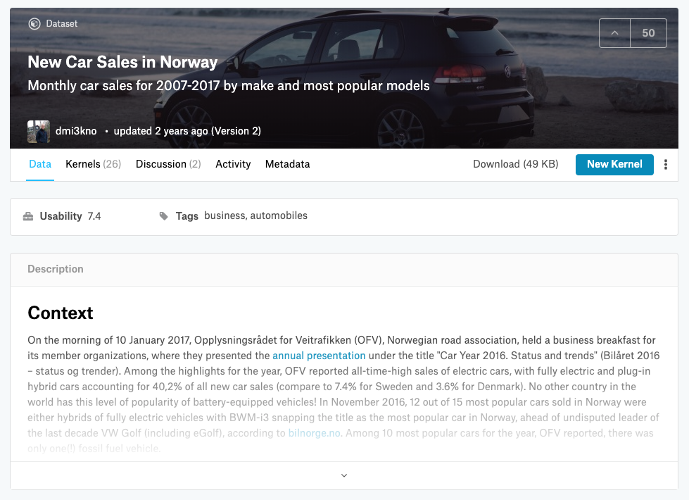

```{r setup, include=FALSE, echo=FALSE}
knitr::opts_chunk$set(echo = TRUE,
                      fig.height = 8,
                      fig.width = 12,
                      warning = FALSE,
                      message = FALSE,
                      cache = TRUE)

htmltools::tagList(rmarkdown::html_dependency_font_awesome())

# Source libs
source("setup.R")

# Simple MAPE function
mape <- function(observed, predicted) {
  mean(abs(observed - predicted) / observed)
}

# CI colors
col_palette <- dci_palette()

```

<br/>
<br/>
   
# Data Loading
<br/>
   

<br>
<br>
As an example, we used the [New Car Sales in Norway](https://www.kaggle.com/dmi3kno/newcarsalesnorway) dataset from Kaggle.
<br>
```{r Data Loading}
# Data loading
df <- fread("norway_new_car_sales_by_make.csv")

# Data preparation
df <- df %>% 
  dplyr::filter(Make == "Mercedes-Benz" | Make == "BMW") %>% 
  dplyr::mutate(Make = case_when(Make == "Mercedes-Benz" ~ "Mercedes",
                                 TRUE ~ Make)) %>% 
  dplyr::mutate(Date = ymd(paste(Year, Month, "01", sep = "-"))) %>% 
  dplyr::select(Date, Quantity, Make) %>% 
  dcast(., Date ~ Make, value.var = "Quantity")

names(df) <- tolower(names(df))

DT::datatable(df,
              options = list(dom = "tp"))
```
<br>    
   
***
<br> 
<br> 
   
# Data Visualization

```{r Data Visualization, out.width = 900}
# Visualize time-series
p <- df %>% 
  melt(id.vars = "date") %>% 
  ggplot(aes(x = date, y = value, color = variable)) + 
    geom_line() + 
    geom_point() + 
    scale_color_manual("", 
                         values = c(col_palette[2], col_palette[1]),
                         labels = c("BMW", "Mercedes-Benz")) + 
    theme_minimal() + 
    labs(x = "Date", y = "Sales", title = "New Car Sales in Norway since 2007") + 
    theme(legend.position = "bottom")

ggplotly(p) %>%
  layout(legend = list(x = 0.1, y = 0.9))
```
<br>   
   
***
<br>
<br>
   
# Feature Engineering
In order to make the machine learning models comparable to Vectorautoregression, we limited feature engineering to the following features:   
<br>
<ul class="fa-ul"> <br>
  <li><i class="fa-li fa fa-angle-double-right"></i> Lags (order $1, 2, 3$) </li>
  <li><i class="fa-li fa fa-angle-double-right"></i> Linear trend ($1, 2, ..., n$) </li>
  <li><i class="fa-li fa fa-angle-double-right"></i> Seasonal dummies ($one-hot-encoded$) </li>
</ul>

```{r Feature Engineering}
# Feature engineering
df_mod <- df %>% 
  dplyr::mutate(mercedes.l1 = dplyr::lag(mercedes, 1),
                mercedes.l2 = dplyr::lag(mercedes, 2),
                mercedes.l3 = dplyr::lag(mercedes, 3),
                bmw.l1 = dplyr::lag(bmw, 1),
                bmw.l2 = dplyr::lag(bmw, 2),
                bmw.l3 = dplyr::lag(bmw, 3),
                trend = 1:n(),
                sd1 = ifelse(lubridate::month(date) %in% c(1, 2, 3), 1, 0),
                sd2 = ifelse(lubridate::month(date) %in% c(4, 5, 6), 1, 0),
                sd3 = ifelse(lubridate::month(date) %in% c(7, 8, 9), 1, 0),
                sd4 = ifelse(lubridate::month(date) %in% c(10, 11, 12), 1, 0)) %>% 
  remove_missing(.)

# Training and test sets
df_train <- df_mod %>% 
  dplyr::filter(date <= ymd("2016-12-01"))

df_test <- df_mod %>% 
  dplyr::filter(date == ymd("2017-01-01"))

glimpse(df_train)
```
<br>   
   
***
<br>
<br>
   
# Model Training

<br>
**Vector Autoregression Model** via `vars::VAR()` 
```{r Train VAR}
# Model formula
form <- mercedes ~ mercedes.l1 + mercedes.l2 + mercedes.l3 + 
  bmw.l1 + bmw.l2 + bmw.l3 + 
  trend + 
  sd1 + sd2 + sd3

# Train VAR model
mod_var <- vars::VAR(y = df_train[, c("mercedes", "bmw")], 
                     p = 3,
                     type = "trend",
                     season = 4)

mod_var
```

<br>
<br>
**Random Forest** via `caret::train()`
```{r Model Train RF}
# Train Random Forest via caret
mod_rf <- caret::train(form = form,
                       data = df_train,
                       method = "rf",
                       trControl = trainControl(method = "none"))

mod_rf
```

<br>
<br>
**XGBoost Model** via `xgboost::xgb.train()`
```{r Model Train XGB}
# Train XGBoost
mod_xgb <- train_xgb(form = form,
                     .data = df_train)

mod_xgb$mod
```


```{r, out.width = 900}

p_var <- predict(mod_var, n.ahead = 1)$fcst$mercedes[1, 1]
p_rf <- predict(mod_rf, newdata = df_test)
p_xgb <- predict_xgb(mod_xgb, newdata = df_test)


predictions <- tibble(date = df_test$date,
                      model = c("var", "rf", "xgb"),
                      p = c(p_var, p_rf, p_xgb))

p <- df_train %>% 
  dplyr::select(date, mercedes) %>% 
  melt(id.vars = "date", value.name = "p", variable.name = "model") %>% 
  dplyr::bind_rows(., predictions) %>% 
  ggplot(., aes(x = date, y = p, color = model, shape = model)) + 
    geom_line() + 
    geom_point() +
    scale_color_manual("", labels = c("MB actuals",
                                      "Random Forest",
                                      "VAR",
                                      "XGBoost"),
                       values = c(col_palette[1], col_palette[2], 
                                  col_palette[3], col_palette[4])) + 
    scale_shape_manual("", labels = c("MB actuals",
                                      "Random Forest",
                                      "VAR",
                                      "XGBoost"),
                       values = c(20, 4, 4, 4)) + 
    labs(x = "Date", y = "Sale", title = "Forecast for New Car Sales in June 2017") + 
    theme_minimal()

ggplotly(p, tooltip = c("colour", "x", "y")) %>%
  layout(legend = list(x = 0.1, y = 0.9))
```
<br>   
   
***
<br>
<br>
   
## Global Model Explanation {.tabset}

### Feature Importance by Drop-out Importance 

<br>
<br>
<i class="fa fa-lightbulb-o fa-lg fa-pull-left" aria-hidden="true"></i> **Idea:**  

> Measure how much the model fit will decrease if a selected feature or group of features will be cancelled out.
> Cancelation can be achived by random feature permutation.   

<br>
Given fitted model $f(x)$ with feature set $X$ and loss function $L(f(x), y)$, do for every feature $x_i \in X$:   

1. create data with permuated feature $x^{*,-i}$   
2. calculate model predictions $f(x^{*,-i})$   
3. calculate permuate model loss $L^{*,-i} = L(f(x^{*,-i}), y)$   
4. calculate feature importance $vip(x_i) = L^{*,-i} - L$, were $L$ is the original loss without permuatation   
<br>

```{r Model Explanation I and Feature Importance, fig.height=12, out.width = 900}
# Features from formula
features <- labels(terms(form))
features <- unlist(strsplit(features, ":"))

# Create training and explaining data.frames
X_train <- df_train[, features]
X_plain <- df_test[, features]

# DALEX explainer for random forest
explainer_rf <- DALEX::explain(model = mod_rf, 
                               data = X_train,
                               y = df_train$mercedes,
                               predict_function = function(model, newdata) {
                                 predict.train(model, newdata = newdata)
                                 },
                               label = "Random Forest"
                               )

# DALEX explainer for XGBoost model
explainer_xgb <- DALEX::explain(model = mod_xgb,
                                data = X_train,
                                y = df_train$mercedes,
                                predict_function = predict_xgb,
                                label = "XGBoost")

# Explainer for VAR model

# Extract linear models form estimated var obj
mod_var_1 <- mod_var$varresult$mercedes
mod_var_2 <- mod_var$varresult$bmw

# Extract training and explaining data.frames from varest obj
X_train_var <- mod_var$datamat[, -c(1, 2)]
y_train_mb_var <- mod_var$datamat[, "mercedes"]
y_train_bmw_var <- mod_var$datamat[, "bmw"]
X_plain_var <- create_Z_varest(mod_var)

# Explainer for VAR equation 1
explainer_var_1 <- DALEX::explain(model = mod_var_1,
                                  data = X_train_var,
                                  y = y_train_mb_var,
                                  predict_function = predict.lm,
                                  label = "VAR")

# Explainer for VAR equation 2
explainer_var_2 <- DALEX::explain(model = mod_var_2,
                                  data = X_train_var,
                                  y = y_train_bmw_var,
                                  predict_function = predict.lm,
                                  label = "VAR")

# Figures
fi_var <- feature_importance(explainer_var_1,
                             loss_function = mape)

fi_rf <- feature_importance(explainer_rf,
                            loss_function = mape)

fi_xgb <- feature_importance(explainer_xgb,
                             loss_function = mape)

# Visualize and adjust standard plot
p <- list(fi_var, fi_rf, fi_xgb) %>% 
  purrr::map(as.data.frame) %>% 
  dplyr::bind_rows() %>% 
  dplyr::filter(!(variable %in% c("_full_model_", "_baseline_"))) %>% 
  ggplot(., aes(x = variable, y = dropout_loss, fill = label)) + 
    geom_bar(stat = "identity") + 
    scale_fill_manual(values = c(col_palette[1], col_palette[2], col_palette[3])) + 
    coord_flip() + 
    labs(y = "Loss-drop (MAPE) after permutation", x = "",
         title = "Model-Agnostic Feature Importance") + 
    facet_wrap(~ label, ncol = 1) + 
    theme_minimal() + 
    theme(legend.position = "none")

ggplotly(p) %>%
  layout(legend = list(x = 0.1, y = 0.9))
```
<br>
<br> 

<i class="fa fa-eye" aria-hidden="true"></i> **Insights:** 

1. **Lead-Time**: On a global level and for all models, short lags (lag 1) are more important
2. **Trend vs. Seasonality vs. AR**: ML models weight trends higher than AR-terms, seasonality is neglectable
3. **Model Selection**: Models share a similar structure in terms of important features

<br>
<br> 
   
### Global Feature Effects

<br>
<br>
<i class="fa fa-lightbulb-o fa-lg fa-pull-left" aria-hidden="true"></i> **Idea:**  

>  Show how the expected model response behaves as a function of a selected feature.

<br>
Frist calculate the so called ceteris paribus (CP) profile $h()$ for the $j$-th:   

$$h^{f,j}_{x*}(z) = f(x_{*}^{j|=z})$$

hence, the prediction of model $f$ for a range of particular values $z$ of the $j$-th variable.

In order to calculate the partial dependency profile (PDP), one can take the average of all CP profiles:

$$\hat{g}^{f,j}_{PD}(z) = \frac{1}{n}\sum^{N}_{i=10}{f(x_{i}^{j|=z})}$$

Or in other words, calculate a CP profile for every observation $i$ in the data and average all CP profiles.


```{r Ceteris Paribus Profile & Partial Depdendency Plot, out.width = 900}

# Ceteris paribus plots
cp_rf <- ceteris_paribus(explainer_rf, new_observation = X_train, variables = c("mercedes.l1", "bmw.l1"))
cp_var <- ceteris_paribus(explainer_var_1, new_observation = X_train, variables = c("mercedes.l1", "bmw.l1"))
cp_xgb <- ceteris_paribus(explainer_xgb, new_observation = X_train, variables = c("mercedes.l1", "bmw.l1"))

# Partial depdendenc plots
pdp_rf <- aggregate_profiles(cp_rf, type = "partial")
pdp_var <- aggregate_profiles(cp_var, type = "partial")
pdp_xgb <- aggregate_profiles(cp_xgb, type = "partial")

p <- plot(pdp_rf, pdp_var, pdp_xgb) + 
  theme_minimal() + 
  scale_color_manual("Model",
                     values = c(col_palette[1], col_palette[2], col_palette[3])) + 
  labs(x = "Feature Value", y = "Average Prediction",
       title = "Partial Dependency Plots for Selected Features") 

ggplotly(p, tooltip = c("")) %>%
  layout(legend = list(x = 0.1, y = 0.9))
```

<br>
<i class="fa fa-exclamation-triangle fa-lg fa-pull-left" aria-hidden="true"></i> &nbsp; **Problem:**  

> Ceteris Paribus Plots and thus Partial Dependency Plots, use the expeced value over the marginal distribution of $X^{-j}$.
> In the present of high correlation between the features in $X$, this might lead bias estimates.

```{r Correlation, out.width = 900, out.height = 800}
p <- df_train %>% 
  dplyr::select_if(is.numeric) %>% 
  cor(use = "pairwise.complete.obs") %>% 
  melt() %>% 
  ggplot(aes(x = Var1, y = Var2, fill = value)) + 
    geom_tile() + 
    labs(x = "", y = "",
         title = "Correlation among Features") + 
    scale_fill_gradient("Correlation", low = col_palette[2], high = col_palette[1]) + 
    theme_minimal() +
    theme(axis.text.x = element_text(angle = 60))

ggplotly(p) %>%
  layout(legend = list(x = 0.1, y = 0.9))
```

<br>
<i class="fa fa-check-square fa-lg fa-pull-left" aria-hidden="true"></i> &nbsp; **Solution:**  

> Therefore, Apley (2018) suggested to use instead of the marginal distrubiton the expeced value over the conditional distribution $(X^j, X^{-j}|X^j=z)$.


```{r Accumulated Local Effects, out.width = 900}
ale_rf <- ingredients::aggregate_profiles(cp_rf, type = "accumulated")
ale_var <- ingredients::aggregate_profiles(cp_var, type = "accumulated")
ale_xgb <- ingredients::aggregate_profiles(cp_xgb, type = "accumulated")

p <- plot(ale_rf, ale_var, ale_xgb) +
  theme_minimal() +
  scale_color_manual("Model",
                     values = c(col_palette[1], col_palette[2], col_palette[3])) +
  labs(x = "Feature Value", y = "Average Prediction",
       title = "Accumulated Local Effects for Selected Features")

ggplotly(p, tooltip = c("")) %>%
  layout(legend = list(x = 0.1, y = 0.9))
```
<br>
<br> 

<i class="fa fa-eye" aria-hidden="true"></i> **Insights:** 

1. **Direction**: Lags for Mercedes and BMW have a positive effect on the forecast
2. **Direction**: For non-linear models the effect of lag reach a plateau

<br>
<br> 
   
### Global Model Drift

<br>
<br>
<i class="fa fa-lightbulb-o fa-lg fa-pull-left" aria-hidden="true"></i> **Idea:**  

> Analyse how the relationship between target variable and input $p(y|X)$ change for new data.

To calculate a drift score for each variable, one can calculate the $L_2$ distance between the PDPs of both models:

$$drift_i = \frac{1}{|Z_i|}\int_{z\in Z_i}{(PDP_i(f_{old}) - PDP_i(f_{new}))^2dz}$$

```{r Viz Old and New Data, out.width = 900}
p <- df %>% 
  dplyr::select(date, mercedes) %>% 
  ggplot(aes(x = date, y = mercedes)) + 
      geom_rect(aes(xmin = min(df$date), 
                    xmax = ymd("2014-12-01"),
                    ymin = 0, 
                    ymax = 1000, 
                    color = "2007-2014"), 
                fill = "transparent",
                lty = "dashed") + 
        geom_rect(aes(xmin = ymd("2015-01-01"), 
                    xmax = max(df$date),
                    ymin = 0, 
                    ymax = 1000, 
                    color = "2015 & 2016"), 
                fill = "transparent",
                lty = "dashed") + 
    geom_line(color = col_palette[1]) + 
    geom_point(color = col_palette[1]) + 
    theme_minimal() + 
    labs(x = "Date", y = "Sales", 
         title = "New Car Sales in Norway since 2007 ") + 
    theme(legend.position = "none")  +
  scale_color_manual(values = c("2007-2014" = "#B5DDE0",
                                "2015 & 2016" = "#71BEC4"))

ggplotly(p, tooltip = c("date", "mercedes")) 
```
<br>
   
**Model Drift for VAR Model (before 2015 and entire data)**
```{r Model Drift}
# # Train model with "old" data
mod_var_old <- df_train %>%
  dplyr::filter(date < ymd("2015-01-01")) %>%
  dplyr::select(mercedes, bmw) %>%
  vars::VAR(y = .,
            p = 3,
            type = "trend",
            season = 4)

# Train model on "full" data
mod_var_new <- df_train %>%
  dplyr::select(mercedes, bmw) %>%
  vars::VAR(y = .,
            p = 3,
            type = "trend",
            season = 4)

# Extract models
mod_var_old <- mod_var_old$varresult$mercedes
mod_var_new <- mod_var_new$varresult$mercedes

# Calculate model drift based on PDP
df_calc <- calculate_model_drift(model_old = mod_var_old,
                                 model_new = mod_var_new,
                                 data_new = df_train,
                                 y_new = df_train$mercedes,
                                 predict_function = predict.lm)

# Format as table
df_calc %>% 
  as.data.frame() %>% 
  dplyr::mutate(stars = paste0(ifelse((drift_scaled > 0.1) & (drift_scaled < 0.2), ".", ""),
                        ifelse(drift_scaled > 0.2, "*", ""),
                        ifelse(drift_scaled > 0.3, "*", ""),
                        ifelse(drift_scaled > 0.4, "*", ""))) %>% 
  dplyr::select(variables, drift, significance = stars) %>% 
  kable() %>% 
  kable_styling(font_size = 14) 
```
<br>
<br>

<i class="fa fa-eye" aria-hidden="true"></i> **Insights:** 

1. **Data Update**: There are minor change in feature effects for data updates

<br>
<br> 
   
## Local Model Explanation {.tabset}   

### Breakdown Plot (Variable Attribution with Interactions)

<br>
<br>
<i class="fa fa-lightbulb-o fa-lg fa-pull-left" aria-hidden="true"></i> **Idea:**  

> Decompose a single prediction into the difference between the single-instance and the average model preidction amogn different features.

<ul class="fa-ul"> <br>
  <li><i class="fa-li fa fa-angle-double-right"></i> Calculate a single-step contribution for each variable </li>
  <li><i class="fa-li fa fa-angle-double-right"></i> Calculate a single-step contribution for every pair of variables </li>
  <li><i class="fa-li fa fa-angle-double-right"></i> Subtract individual contributions to assess the size of non additivness </li>
  <li><i class="fa-li fa fa-angle-double-right"></i> Order interaction effects and additive effects in a list to determin the final order for conditioning/explanations </li>
</ul>


```{r Breakdown Plots}

# Variable Attribution including Interactions 
bd_rf <- iBreakDown::break_down(explainer_rf,
                                new_observation = X_plain,
                                interactions = TRUE)

bd_var <- iBreakDown::break_down(explainer_var_1,
                                 new_observation = X_plain_var,
                                 interactions = TRUE)

bd_xgb <- iBreakDown::break_down(explainer_xgb,
                                 new_observation = X_plain,
                                 interactions = TRUE)

cols <- c(`-1` = "firebrick4",
          `0` = col_palette[3],
          `1` = col_palette[4],
           X = col_palette[1])

# p1 <- plot(bd_rf, vcolors = cols) + 
#   guides(fill = "none") + 
#   theme_minimal()
# 
# p2 <- plot(bd_var, vcolors = cols) + 
#   guides(fill = "none") + 
#   theme_minimal()
# 
# p3 <- plot(bd_xgb, vcolors = cols) + 
#   guides(fill = "none") + 
#   theme_minimal()

p1 <- plot_waterfall(explain_object = bd_rf, title_string = "Random Forest")
p2 <- plot_waterfall(explain_object = bd_var, title_string = "VAR")
p3 <- plot_waterfall(explain_object = bd_xgb, title_string = "XGBoost")
```
<br>

<i class="fa fa-eye" aria-hidden="true"></i> **Insights:** 


1. **Feature Impact**: For ML models, prediction is mainly driven by the trend (up to 50%)
2. **Feature Impact**: Lags have a mixed but substential influence for all models
3. **Feature Impact**: Contribution of seasonality is neglectable

<br>
<br> 


```{r, fig.height = 4.7, echo = FALSE}
ggplotly(p1, tooltip = c(""))
ggplotly(p2, tooltip = c(""))
ggplotly(p3, tooltip = c("")) 
```
    

### Local Feature Importance (LIME)

**L**ocal **I**nterpretable **M**odel-Agnostic **E**xplanations (LIME)

<br>
<br>
<i class="fa fa-lightbulb-o fa-lg fa-pull-left" aria-hidden="true"></i> **Idea:**  

> Locally approximate a black-box model by a sparse (fewer features) local white-box suggrogate model.


The idea can be formulized by finding a local white-box surrogate model $M_*$ that sufficiently approximates a black-box model $f$ in the neighborhoud of $x_*$:

$$M(x_*) = arg min_{g \in G} L(f, g, N_x) + \Omega(g)$$

For a selected data point $x_*$, find a local model $g$ from the class of interpretable models (e.g. linear models) $G$ which minimizes an arbitary loss $L$ in the neighborhood $N_x$ of $x_*$.
In order to ensure interpretability, $\Omega(g)$ is added as a penality for model complexity.
   <br>   
The algorithm works as follows:   
<ul class="fa-ul"> <br>
  <li><i class="fa-li fa fa-angle-double-right"></i> Select your instance of interest $x_*$ for which you want to have an explanation of its black box prediction $f(x_*)$ </li>
  <li><i class="fa-li fa fa-angle-double-right"></i> Perturb your dataset and get the black box predictions for these new points  </li>
  <li><i class="fa-li fa fa-angle-double-right"></i> Weight the new samples according to their proximity to the instance of interest </li>
  <li><i class="fa-li fa fa-angle-double-right"></i> Train a weighted, interpretable model $g$ on the dataset with the variations </li>
  <li><i class="fa-li fa fa-angle-double-right"></i> Explain the prediction by interpreting the local model </li>
</ul>

```{r LIME, fig.height=15}
lime_var <- Predictor$new(mod_var_1, 
                          data = X_train, 
                          y = df_train$mercedes,
                          predict.fun = predict.lm) %>% 
  LocalModel$new(., x.interest = X_plain_var)

lime_rf <- Predictor$new(mod_rf, 
                         data = X_train, 
                         y = df_train$mercedes,
                         predict.train) %>% 
  LocalModel$new(., x.interest = X_plain)

lime_xgb <- Predictor$new(mod_xgb, 
                          data = X_train, 
                          y = df_train$mercedes,
                          predict.fun = predict_xgb) %>% 
  LocalModel$new(., x.interest = X_plain)

p1 <- plot_lime(lime_object = lime_var,
          model_type = "VAR")
p2 <- plot_lime(lime_object = lime_rf,
          model_type = "Random Forest")
p3 <- plot_lime(lime_object = lime_xgb,
          model_type = "XGBoost")

grid.arrange(p1, p2, p3)
```
<br>

<i class="fa fa-eye" aria-hidden="true"></i> **Insights:** 

1. **Feature Impact**: ML Models rely on Trend and Lags
2. **Feature Impact**: VAR prediction is driven by Mercedes Lags

<br>
<br> 

### Local-Fidelity Plot

<br>
<br>
<i class="fa fa-lightbulb-o fa-lg fa-pull-left" aria-hidden="true"></i> **Idea:**  

> Compare a certain prediction (obversation) by selecting neighboring obversation (based on features) and comparing the stability of CP profiles.

<ul class="fa-ul"> <br>
  <li><i class="fa-li fa fa-angle-double-right"></i> Identification of nearest neighbors (e.g. via gower distance) </li>
  <li><i class="fa-li fa fa-angle-double-right"></i> Calculation and visualization of CP profiles for the selected neighbors </li>
  <li><i class="fa-li fa fa-angle-double-right"></i> Analysis of residuals for the neighbors </li>
</ul>


```{r KNN and Local-Fidelity Plot, out.width = 900}
# knn-algorithm for neighbours based on BMW 
out <- capture.output(
  neighbors_test <- select_neighbours(df_mod, 
                                      df_test, 
                                      n = 25, 
                                      variables = c("bmw.l1", 
                                                    "sd1", "sd2", "sd3"))
)

# Generate ceteris paribus profile for test data
cp_xgb_test <- ceteris_paribus(explainer_xgb, 
                               new_observation = X_plain, 
                               y = df_test$mercedes,
                               variables = c("mercedes.l1"))

# Generate ceteris paribus profile for neighbors of test data
cp_xgb_neighbors <- ceteris_paribus(explainer_xgb, 
                                    new_observation = neighbors_test, 
                                    variables = c("mercedes.l1"))

p <- plot(cp_xgb_neighbors, color = '#ceced9') + 
  show_observations(cp_xgb_test, variables = "mercedes.l1", size = 5, color = col_palette[2]) + 
  labs(x = "Value of Mercedes Lag 1", y = "Prediction", 
       title = "Local-Fidelity Plot (XGBoost) Compaing Test Data with 25 Nearest Neighbours") + 
  theme_minimal() +
  geom_point(aes(text = paste0(`_ids_`, " ", `_label_`, 
                               ": x = ", round(`_x_`, 0), 
                               ", y = ", round(`_yhat_`, 0))),
            color = "transparent")


ggplotly(p, tooltip = c("text"))
```

<br>

<i class="fa fa-eye" aria-hidden="true"></i> **Insights:** 

1. **Feature Impact**: The Lag-impact for the selected data point is consistent with similar situations within the available historic data

